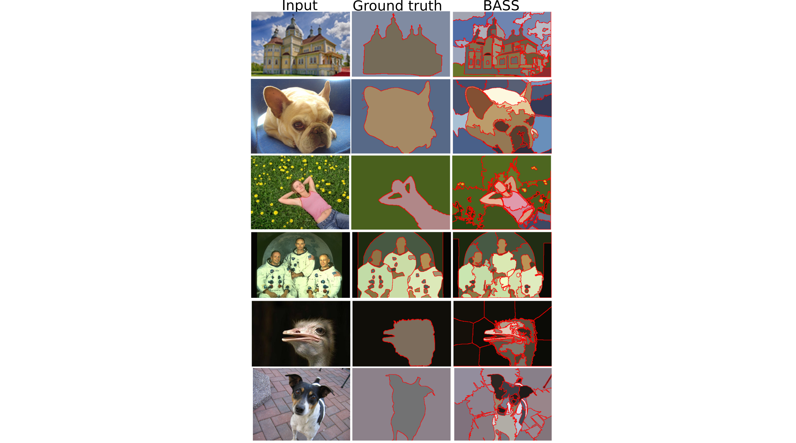

# BASS: Boundary-Aware Superpixel Segmentation

## How do I get set up?
Clone the repo, go to code folder and compile as follows (you will need to remove an extra space created in link.txt):
```
$ cd code
$ mkdir build
$ cd build
$ cmake ..
$ sed -i 's/ --no-whole-archive/--no-whole-archive/g' CMakeFiles/bass.dir/link.txt 
$ make
```
## How to make it work?
From the command line, run:
```
$ ./path_to_build/bass path_to_img_or_folder -s ns
```
where _ns_ is the desired number of initial seeds for superpixels. The command will apply BASS in all the images in the folder. Results will be stored in _path_to_img_or_folder/output_, that needs to be previously created at this point (will be fixed in future updates).

For instance, from the root folder of this repo:
```
$ ./code/build/bass imgs/ -s 50
```
If you use this code, please cite the following [paper](http://hi.cs.waseda.ac.jp/~esimo/publications/RubioICPR2016.pdf):

**Boundary-Aware Superpixel Segmentation**  
Antonio Rubio, Longlong Yu, Edgar Simo-Serra, Francesc Moreno-Noguer  
_International Conference on Pattern Recognition (ICPR), 2016_
```
@InProceedings{RubioICPR2016,
   author = {Antonio Rubio and Longlong Yu and Edgar Simo-Serra and Francesc Moreno-Noguer},
   title = {{BASS: Boundary-Aware Superpixel Segmentation}},
   booktitle = "Proceedings of the International Conference on Pattern Recognition (ICPR)",
   year = 2016,
}
```

Some tools for this code are extracted and/or modified from [D.Stutz](https://github.com/davidstutz/seeds-revised)'s work [1].
 
 [1] **D. Stutz, A. Hermans, B. Leibe.**  
     Superpixel Segmentation using Depth Information.  
     _Bachelor thesis, RWTH Aachen University, Aachen, Germany, 2014._
